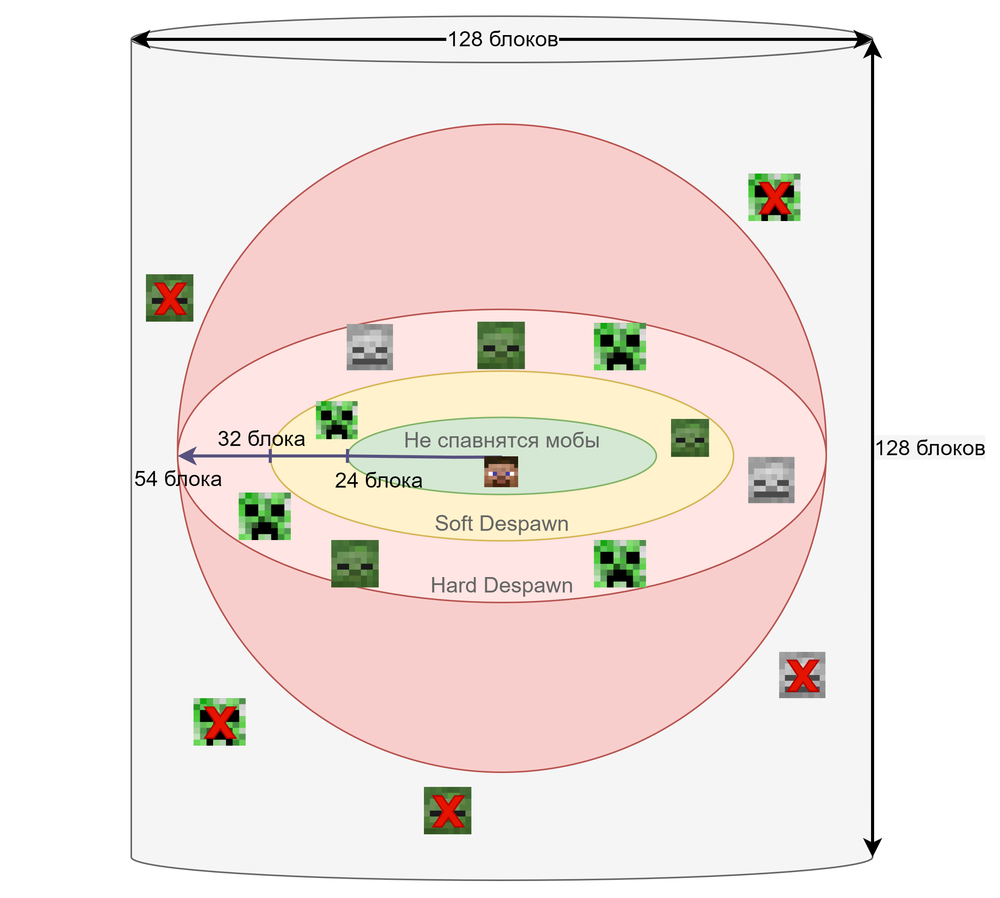

# Спавн мобов

## График
Ниже график как работает спавн мобов. Это ванильная механика, мы только уменьшили значения Hard Despawn с 128 до 54 блока.

## Пояснение графика
- Цилиндр указывает диапазон появления мобов.
- Красная сфера указывает на зону появления мобов (между 24 и 54 блоками).
- Зеленая сфера указывает на зону, свободную от мобов, так как моб не будет появляться так близко к игроку (до 24 блока).
- Любой моб, попадающий под кольцо до 32 блока (диапазон активации сущности), будет тикать в нормальном режиме.
- Любой моб, находящийся между кольцом из 32–54 блока, будет тикать медленее.
- Моб, который выходит за пределы 54-го блока, мгновенно исчезает.